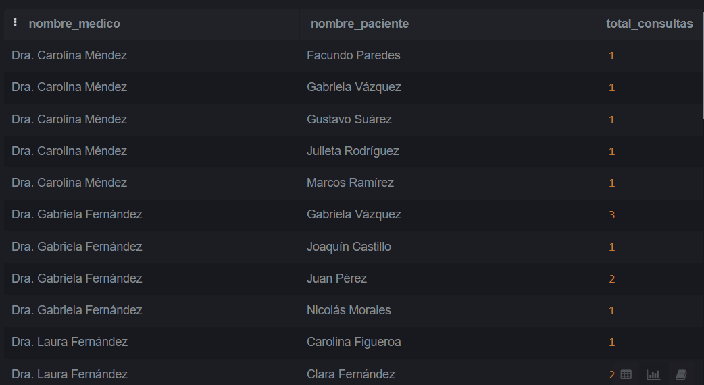

## Ejercicio 1

### Qué tipo de base de datos es? Clasificarla según estructura y función.

Según su función, la base de datos es de tipo transaccional su objetivo es almacenar y gestionar datos en tiempo real, optimizando la velocidad de inserción, actualización y consulta para operaciones cotidianas de un centro médico.

Segun su estructura, la base de datos es relacional (SQL) ya que está organizada en tablas con filas y columnas, donde cada tabla representa una entidad (pacientes, médicos, medicamentos, consultas, recetas).
### 2. Armar el diagrama entidad-relación de la base de datos dada.
3. Armar el Modelo relacional de la base de datos dada


### 3. Armar el Modelo relacional de la base de datos dada.


### ¿Considera que la base de datos está normalizada? En caso que no lo esté, ¿cómo podría hacerlo? Nota: no debe normalizar la base de datos, solo explicar como lo haría.

Cumple con la primera forma normal ya que cada celda posee un único valor. Cumple con la segunda forma normal ya que no hay dependencias parciales.
Sin embargo, creemos que no cumple con la tercera forma normal debido a la dependencia entre diagnóstico y snomedcodigo. Para normalizarlo separaríamos los diagnósticos con sus correspondientes códigos en una tabla aparte. 


## Ejercicio 2

**1. Cuando se realizan consultas sobre la tabla paciente agrupando por ciudad los tiempos de respuesta son demasiado largos. Proponer mediante una query SQL una solución a este problema.**

```sql
CREATE INDEX IF NOT EXISTS idx_ciudades 
  ON pacientes (ciudad);
```

**2. Se tiene la fecha de nacimiento de los pacientes. Se desea calcular la edad de los pacientes y almacenarla de forma dinámica en el sistema ya que es un valor típicamente consultado, junto con otra información relevante del paciente

```sql
UPDATE pacientes
SET edad = EXTRACT(YEAR FROM AGE(CURRENT_DATE, fecha_nacimiento));}

```

**3.  La paciente, “Luciana Gómez”, ha cambiado de dirección. Antes vivía en “Avenida Las Heras 121” en “Buenos Aires”, pero ahora vive en “Calle Corrientes 500” en “Buenos Aires”. Actualizar la dirección de este paciente en la base de datos.**

```sql
UPDATE pacientes 
SET calle = 'Calle Corrientes', numero= 500'
WHERE id_paciente = 1;

```

**4. Seleccionar el nombre y la matrícula de cada médico cuya especialidad sea identificada por el id 4.**

```sql
UPDATE pacientes 
SET calle = 'Calle Corrientes', numero= 500'
WHERE id_paciente = 1;
```


**5. Puede pasar que haya inconsistencias en la forma en la que están escritos los nombres de las ciudades, ¿cómo se corrige esto? Agregar la query correspondiente.**

encontramos 2 formas.
```sql
-- Corregir las variaciones de Buenos Aires, incluyendo espacios
UPDATE Pacientes
SET ciudad = 'Buenos Aires'
WHERE TRIM(LOWER(ciudad)) IN ('buenos aires', 'buenos aiers', 'bs aires');

-- Corregir el error en Mendoza, incluyendo espacios
UPDATE Pacientes
SET ciudad = 'Mendoza'
WHERE TRIM(LOWER(ciudad)) = 'mendzoa';

-- Corregir el error en Córdoba, incluyendo espacios y la variación sin tilde
UPDATE Pacientes
SET ciudad = 'Córdoba'
WHERE TRIM(LOWER(ciudad)) IN ('córodba', 'cordoba');
```


**6. Obtener el nombre y la dirección de los pacientes que viven en Buenos Aires.**

```sql
SELECT nombre,numero,calle
FROM Pacientes
WHERE ciudad = 'Buenos Aires';
```


**7. Cantidad de pacientes que viven en cada ciudad.**
```sql
SELECT TRIM(LOWER(ciudad)) AS ciudad_normalizada, COUNT(*) AS cantidad_pacientes
FROM Pacientes
GROUP BY TRIM(LOWER(ciudad));
```
Notar que hay un error en buenos aires que no pudimos corregir (usamos alternativa 1) por lo que serían 8 de buenos aires.


**8 Cantidad de pacientes por sexo que viven en cada ciudad.** 
```sql
SELECT 
    ciudad, 
    id_sexo, 
    COUNT(*) AS cantidad_pacientes
FROM 
    pacientes
GROUP BY 
    ciudad, id_sexo
ORDER BY 
    ciudad, id_sexo;

```


**9. Obtener la cantidad de recetas emitidas por cada médico** 
```sql
SELECT 
    m.nombre, 
    COUNT(r.id_receta) AS cantidad_recetas
FROM 
    medicos m
JOIN 
    recetas r ON m.id_medico = r.id_medico
GROUP BY 
    m.nombre
```


**10. Obtener todas las conultas médicas realizadas por el médico con ID igual a 3 en el mes de agosto de 2024** 
```sql
SELECT 
    *
FROM 
    consultas
WHERE 
    id_medico = 3 
    AND fecha >= '2024-08-01' 
    AND fecha < '2024-09-01';
```


**11. Obtener el nombre de los pacientes junto con la fecha y el diagnóstico de todas las consultas médicas realizadas en agosto del 2024.**
```sql
SELECT 
    p.nombre,       -- p se refiere a la tabla pacientes
    c.fecha,       -- c se refiere a la tabla consultas
    c.diagnostico
FROM 
    pacientes p    
JOIN 
    consultas c ON p.id_paciente = c.id_paciente  
WHERE 
    c.fecha >= '2024-08-01' 
    AND c.fecha < '2024-09-01';
```


**12. Obtener el nombre de los medicamentos prescritos más de una vez por el médico con ID igual a 2.**

```sql

SELECT 
    m.nombre
FROM 
    recetas p
JOIN 
    medicamentos m ON p.id_medicamento = m.id_medicamento
WHERE 
    p.id_medico = 2
GROUP BY 
    m.nombre
HAVING 
    COUNT(*) > 1;

```


**13. Obtener el nombre de los pacientes junto con la cantidad total de recetas que han recibido.**
```sql
SELECT 
    p.nombre, 
    COUNT(r.id_receta) AS cantidad_recetas
FROM 
    pacientes p
LEFT JOIN 
    recetas r ON p.id_paciente = r.id_paciente
GROUP BY 
    p.id_paciente, p.nombre
ORDER BY 
    p.nombre;
```


**14. Obtener el nombre del medicamento más recetado junto con la cantidad de recetas emitidas para ese medicamento.**

```sql
SELECT 
    m.nombre, 
    COUNT(r.id_receta) AS cantidad_recetas
FROM 
    recetas r
JOIN 
    medicamentos m ON r.id_medicamento = m.id_medicamento
GROUP BY 
    m.id_medicamento, m.nombre
ORDER BY 
    cantidad_recetas DESC
LIMIT 1;
```


**15. Obtener el nombre del paciente junto con la fecha de su última consulta y el diagnóstico asociado.**
```sql
SELECT 
    p.nombre, 
    c.fecha, 
    c.diagnostico
FROM 
    pacientes p
JOIN 
    consultas c ON p.id_paciente = c.id_paciente
WHERE 
    c.fecha = (
        SELECT MAX(fecha) 
        FROM consultas 
        WHERE id_paciente = p.id_paciente
    );

```


**16. Obtener el nombre del médico junto con el nombre del paciente y el número total de consultas realizadas por cada médico para cada paciente, ordenado por médico y paciente  .** 
```sql
SELECT 
    m.nombre AS nombre_medico, 
    p.nombre AS nombre_paciente, 
    COUNT(c.id_consulta) AS total_consultas
FROM 
    medicos m
JOIN 
    consultas c ON m.id_medico = c.id_medico
JOIN 
    pacientes p ON c.id_paciente = p.id_paciente
GROUP BY 
    m.id_medico, m.nombre, p.id_paciente, p.nombre
ORDER BY 
    m.nombre, p.nombre;
```


**17 Obtener el nombre del medicamento junto con el total de recetas prescritas para ese medicamento, el nombre del médico que lo recetó y el nombre del paciente al que se le recetó, ordenado por total de recetas en orden descendente.**

```sql

SELECT 
    m.nombre AS nombre_medicamento,
    COUNT(r.id_receta) AS total_recetas,
    med.nombre AS nombre_medico,
    p.nombre AS nombre_paciente
FROM 
    recetas r
JOIN 
    medicamentos m ON r.id_medicamento = m.id_medicamento
JOIN 
    medicos med ON r.id_medico = med.id_medico
JOIN 
    pacientes p ON r.id_paciente = p.id_paciente
GROUP BY 
    m.id_medicamento, m.nombre, med.id_medico, med.nombre, p.id_paciente, p.nombre
ORDER BY 
    total_recetas DESC;
```


**18.  Obtener el nombre del médico junto con el total de pacientes a los que ha atendido, ordenado por el total de pacientes en orden descendente .**

```sql
SELECT 
    m.nombre AS nombre_medico, 
    COUNT(DISTINCT c.id_paciente) AS total_pacientes
FROM 
    medicos m
JOIN 
    consultas c ON m.id_medico = c.id_medico
GROUP BY 
    m.id_medico, m.nombre
ORDER BY 
    total_pacientes DESC;
```

